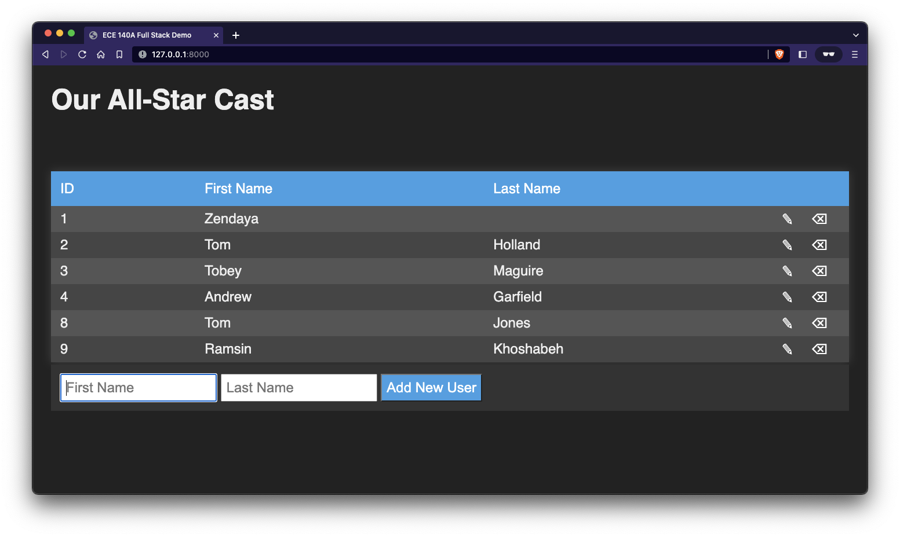

# FastAPI Full-Stack Auth Demo

This repo is a full-stack app using the [FastAPI web framework](https://fastapi.tiangolo.com), MySQL for a database, and REST to interact with a simple users table. You may install MySQL natively or use the included Docker file to create a database in a containter. The `init-db.sql` defines a simple schema for use with the example.



## Prerequesites

You just need to have Python 3.7+ installed (3.10+ for the simplified typehinting).

## TODO

1. Switch to sending username/password in header! (https://fastapi.tiangolo.com/advanced/security/http-basic-auth/)
2. Switch to making the authenticate function a dependency: (https://fastapi.tiangolo.com/az/tutorial/security/simple-oauth2)

## Usage

1. Create database credentials (specify your own **USERNAME**, **PASSWORD**, and **ROOT_PASSWORD**!)

    ```bash
    echo "MYSQL_HOST=localhost" > credentials.env
    echo "MYSQL_DATABASE=ece140" >> credentials.env
    echo "MYSQL_USER=USERNAME" >> credentials.env
    echo "MYSQL_PASSWORD=PASSWORD" >> credentials.env
    echo "MYSQL_ROOT_PASSWORD=ROOT_PASSWORD" >> credentials.env
    ```

2. If you have Docker installed, run the following command to start up a MySQL server (ignore this step if you already have MySQL installed and modify the `credentials.env` file to match your database credentials!). Run the command in a separate terminal window as it will lock up the window for logging.

    ```bash
    docker compose up --build &
    ```

    **Note:** Just closing the terminal will not stop the database server. In order to stop it, you must issue the command `docker-compose down` when you are finished.

3. Create a Python virtual environment

    ```bash
    python3 -m venv env
    ```

4. Start the virtual environment

    ```bash
    source env/bin/activate
    ```

5. Install dependencies

    ```bash
    pip install -U pip
    pip install -r requirements.txt
    ```

6. Seed the database

    ```bash
    cd server
    python seed-users.py
    ```

7. Run the server

    ```bash
    python main.py
    ```

    or

    ```bash
    uvicorn main:app --reload
    ```

8. Visit the docs page to access the login/logout POST routes

    ```bash
    http://127.0.0.1:8000/docs
    ```

9. Once logged in, you can visit the protected route to see if you're logged in

    ```bash
    http://127.0.0.1:8000/protected
    ```
